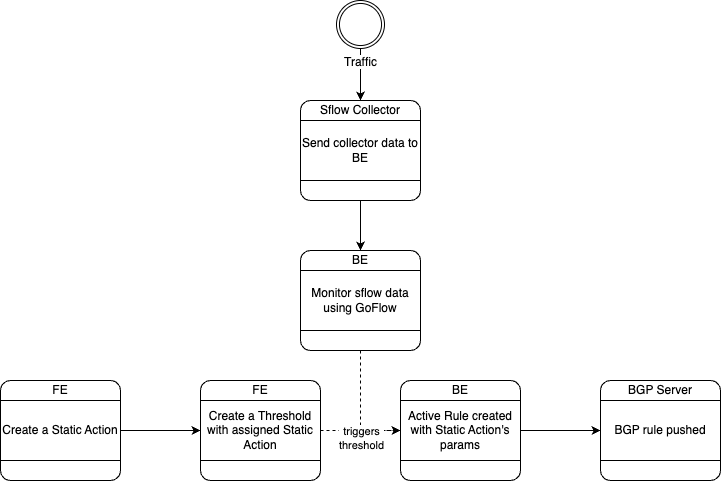

Automatic BGP Rule Generation
=============================

.. _auto-bgp-rule:

Overview
--------

    Automatic BGP Rule Generation Flowchart

Automatic BGP rule generation is a feature that simplifies the management and configuration of BGP routing policies based on predefined **thresholds** and **static actions**. BGP is the protocol used for exchanging routing information between autonomous systems (AS) on the internet, enabling the routing of data packets across networks. BGP rules define how traffic should be routed between ASs.

In the traditional manual approach, network administrators configure BGP rules manually, which can be time-consuming and prone to errors. However, with automatic BGP rule generation using predefined thresholds and static actions, the process becomes more efficient and less error-prone.

Here is an overview of the main steps involved in the automatic BGP rule generation process:

1. Threshold Definition: Network administrators define specific thresholds for various network parameters. These thresholds serve as triggers to identify network conditions that require BGP rule adjustments.
2. Data Collection: Network telemetry data, including BGP routing updates, traffic flow information, and performance metrics, is collected from routers and other network devices. This data provides valuable insights into the current network state.
3. Data Analysis: The collected data is analyzed to compare it against the predefined thresholds. When the data exceeds the defined thresholds, it indicates a network condition that requires action.
4. Action Determination: For each defined threshold, network administrators predefine static actions to be taken when the corresponding threshold is crossed. These actions can include modifying BGP attributes, changing the path selection, redistributing routes, filtering or manipulating route advertisements, or any other actions necessary to optimize network performance or address specific requirements.
5. Rule Generation: Based on the analysis of the collected data and the threshold crossings, the system generates BGP rule (**active rule**) that align with the predefined static actions and push the rule configurations to the appropriate routers or BGP speakers.
8. Continuous Monitoring and Adaptation: Automatic BGP rule generation is an iterative process. The deployed rules are continuously monitored, and network telemetry data is collected to assess their performance. If necessary, network administrators review and update the predefined thresholds and static actions based on network requirements or changing conditions, even the pushed BGP rule can be updated if needed.

By using predefined thresholds and static actions, automatic BGP rule generation streamlines the configuration and optimization of BGP routing policies. This feature helps network administrators improve network performance, increase efficiency, and reduce the manual effort required to manage BGP rules effectively.

Main Components
---------------

The main components for this feature are:
  - Thresholds
      A threshold is a set of defined filters and limit to monitor the traffic, and if the traffic is above the limit, it will trigger a static action assigned to the threshold.
  - Static Actions
      A static action is a simplified BGP rules to be executed when a threshold limit is triggered.
  - Active Rules
      A set of BGP rules as a result of threshold triggered a static action.

There are two kinds of thresholds:
  - Connection Limit threshold
      A connection limit threshold will monitor a specific destination IP address, source ports, and destination ports traffic.
  - Packet Limit threshold
      A packet limit threshold will monitor a specific destination IP address and packet length traffic.
