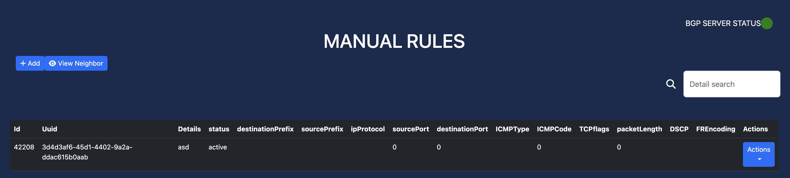

Main Features
=============

IP Statistics
-------------
This feature enables users to monitor Sflow IP statistics and track BGP server's status.

How to access:
  - Log in to your account.
  - From the dashboard, navigate to the "IP Statistics" section.

Actions available:
  - Filter the IP Statistics by UDP Source Ports, UDP Destination Ports, and Unique Connection Threshold in the Settings section, :ref:`connection-limit` part.
  - View unfiltered IP Statistics by typing the destination IP address in the search box.

Manual BGP Rules
----------------
This feature allows users to manually push BGP configurations easily.

How to access:
  - Log in to your account.
  - From the dashboard, navigate to the "Manual Rules" section.

Actions available:
  - Add a BGP rule
  - View current BGP neighbors
  - Filter BGP rules based on destination IP address
  - Edit a BGP rule

Automatic BGP Rules
------------
This feature allows users to define a threshold that will automatically push BGP configurations if the threshold is triggered.

Step-by-step instructions:
  1. Log in to your account.
  2. Define a threshold:
    a. Navigate to "Thresholds" section.
  3. Define a static action:
    a. Navigate to "Static Actions" section.
  4. Check the active rules:
    a. Navigate to "Active Rules" section.
