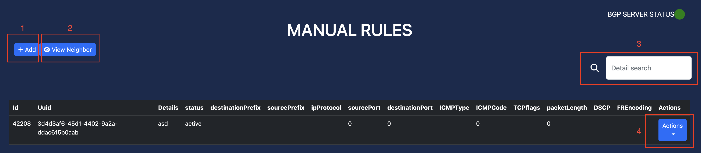

Main Features
=============

IP Statistics
-------------
This feature enables users to monitor Sflow IP statistics and track BGP server's status.

How to access:
  - Log in to your account.
  - From the dashboard, navigate to the **IP Statistics** section.

Actions available:
  - Filter the IP Statistics by UDP Source Ports, UDP Destination Ports, and Unique Connection Threshold in the Settings section, :ref:`connection-limit` part.
  - View unfiltered IP Statistics by typing the destination IP address in the search box.

Manual BGP Rules
----------------
This feature allows users to manually push BGP configurations easily.

How to access:
  - Log in to your account.
  - From the dashboard, navigate to the **Manual Rules** section.

Actions available:
  - Add a BGP rule
  - View current BGP neighbors
  - Filter BGP rules based on destination IP address
  - Edit a BGP rule

    Manual Rules

Automatic BGP Rules
-------------------
This feature allows users to define a threshold that will automatically push BGP configurations (active rule) if the threshold is triggered.

Terms:
  - Thresholds
    A threshold is a set of defined filters and limit to monitor the traffic, and if the traffic is above the limit, it will trigger a static action assigned to the threshold.
  - Static Actions
    A static action is a simplified BGP rules to be executed when a threshold limit is triggered.
  - Active Rules
    A set of BGP rules as a result of threshold triggered a static action.

There are two kinds of thresholds:
  - Connection Limit threshold
      A connection limit threshold will monitor a specific destination IP address, source ports, and destination ports traffic.
  - Packet Limit threshold
      A packet limit threshold will monitor a specific destination IP address and packet length traffic.

Step-by-step instructions:
  1. Log in to your account.
  2. Define a threshold:
    a. Navigate to **Thresholds** section.

    .. figure:: images/thresholds.png
        :align: center

        Thresholds

    b. Add a new threshold using the **Add Threshold** button (*area number 1 in the picture above*). This will open up an **Add Threshold** modal.
    c. Select the threshold: **Packet Tracking** or **Connection Limit**
    c. Fill the fields in the modal:

      For **Connection Limit**:

      +-------------------------------------------+---------------------------------------------+---------------------------------------------------------------------------------------------------------------+
      | Field                                     | Sample Data                                 | Description                                                                                                   |
      +===========================================+=============================================+===============================================================================================================+
      | Destination Prefix                        | 192.168.1.0/24                              | *Optional*. If this is defined, then the threshold only track the specific destination prefix in CIDR format. |
      +-------------------------------------------+---------------------------------------------+---------------------------------------------------------------------------------------------------------------+
      | Traffic Type                              | UDP/TCP/ICMP                                | The traffic type to be tracked.                                                                               |
      +-------------------------------------------+---------------------------------------------+---------------------------------------------------------------------------------------------------------------+
      | Connection Rate                           | 10                                          | *Required*. The unique connections minimum required to trigger this threshold.                                |
      +-------------------------------------------+---------------------------------------------+---------------------------------------------------------------------------------------------------------------+
      | Connection Interval                       | 100                                         | *Required*. The period which the unique connections is collected (in seconds).                                |
      +-------------------------------------------+---------------------------------------------+---------------------------------------------------------------------------------------------------------------+
      | Source Ports                              | 16,53,123,389,161,1194,1900,3283,3702,11211 | *Optional*. The UDP source ports to be tracked, all ports will be tracked if empty.                           |
      +-------------------------------------------+---------------------------------------------+---------------------------------------------------------------------------------------------------------------+
      | Destination Ports                         | 25565,25566                                 | *Optional*. The UDP destination ports to be tracked, all ports will be tracked if empty.                      |
      +-------------------------------------------+---------------------------------------------+---------------------------------------------------------------------------------------------------------------+
      | Include all detected ports in Active Rule | Enabled/Disabled                            | If enabled, the ports which triggered the threshold is also included in the active rules.                     |
      +-------------------------------------------+---------------------------------------------+---------------------------------------------------------------------------------------------------------------+
      | Static Actions                            | selection                                   | *Required*. The static actions to be executed if the threshold is triggered.                                  |
      +-------------------------------------------+---------------------------------------------+---------------------------------------------------------------------------------------------------------------+
      | Time Limit                                | 3600                                        | *Optional*. The time before the active rule is expired (in seconds).                                          |
      +-------------------------------------------+---------------------------------------------+---------------------------------------------------------------------------------------------------------------+
      | Enable                                    | Enabled/Disabled                            | Enable/disable this threshold                                                                                 |
      +-------------------------------------------+---------------------------------------------+---------------------------------------------------------------------------------------------------------------+

      For **Packet Limit**

    d. Click the blue **Add** button.

    .. note::
        If the user wants to edit or delete the threshold created, use the edit/delete button at the *area number 2 in the picture above*.
    .. note::
        Filter the Connection Limit threshold or Packet Limit threshold using the filter in *area number 3 in the picture above*.

  3. Define a static action:
    a. Navigate to **Static Actions** section.

    .. figure:: images/static-actions.png
        :align: center

        Static Actions

    b. Add a new static action using the **Add Static Action** button (*area number 1 in the picture above*). This will open up a **Add Static Action** modal.
    c. In the modal, define the actions (BGP rule) to be taken when a threshold is triggered. The actions available are:
      - Block all UDP ports
      - Block all TCP ports
      - Block all ICMP ports
      - Block specific UDP source ports
      - Block specific TCP source ports
      - Block specific UDP destination ports
      - Block specific TCP destination ports
      - Block specific packet lengths
      - Limit the packet rate
    d. Lastly, enable or disable the static action and click **Add** button on the top right.

    .. note::
        If the user wants to edit or delete the static action created, use the edit/delete button at the *area number 2 in the picture above*.

  4. Check the active rules:
    a. Navigate to **Active Rules** section.

    .. figure:: images/active-rules.png
        :align: center

        Active Rules
    
    b. User can edit/delete the BGP rule from the edit/delete button at the *area number 1 in the picture above*.

    .. note::
        This dashboard will show which active rules are currently created from the threshold triggers.